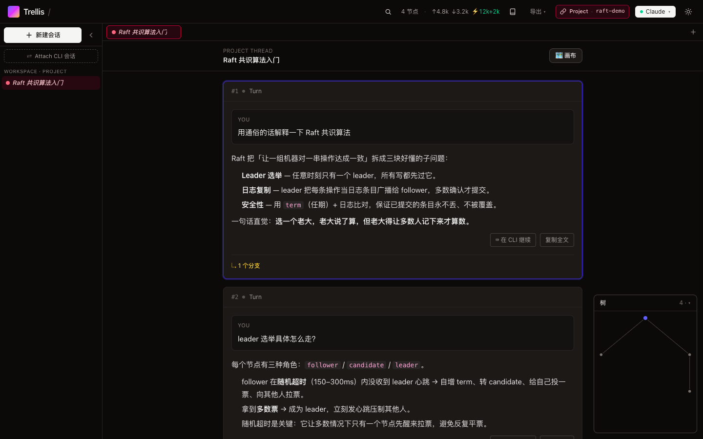
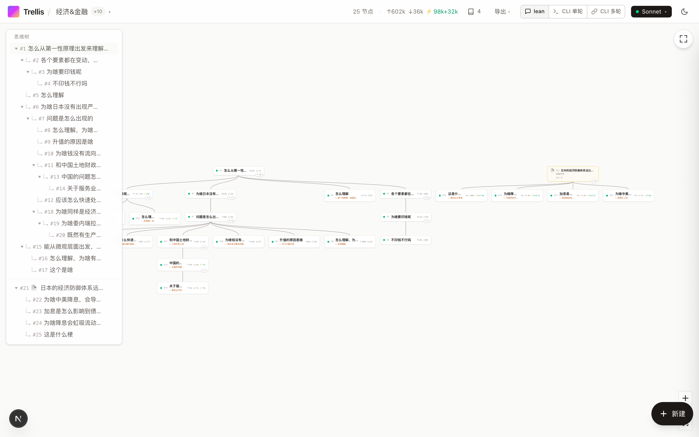
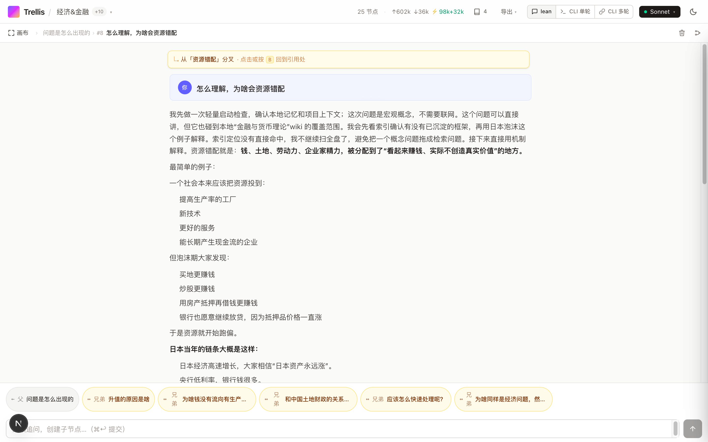
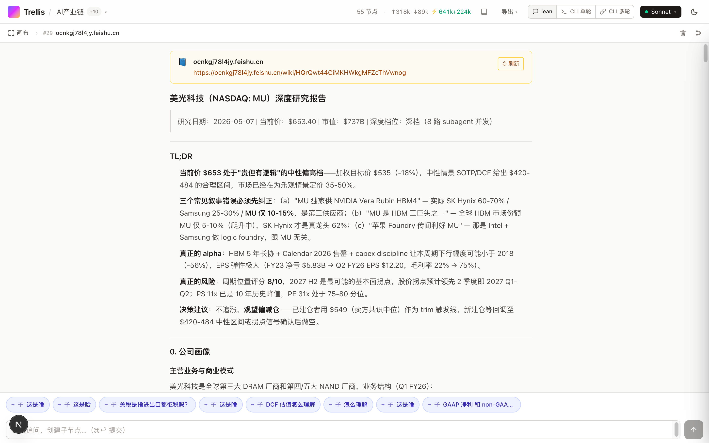
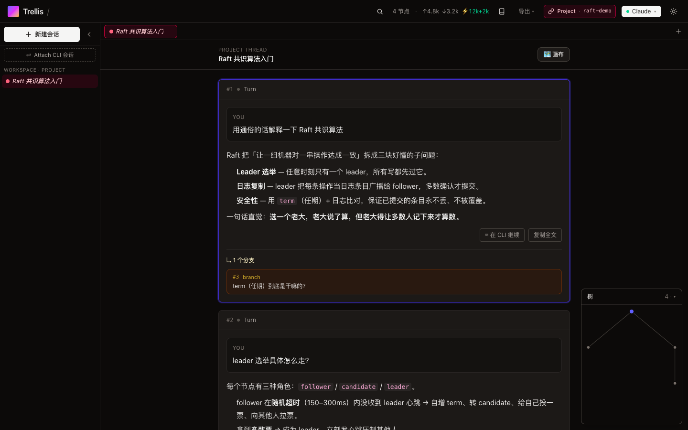
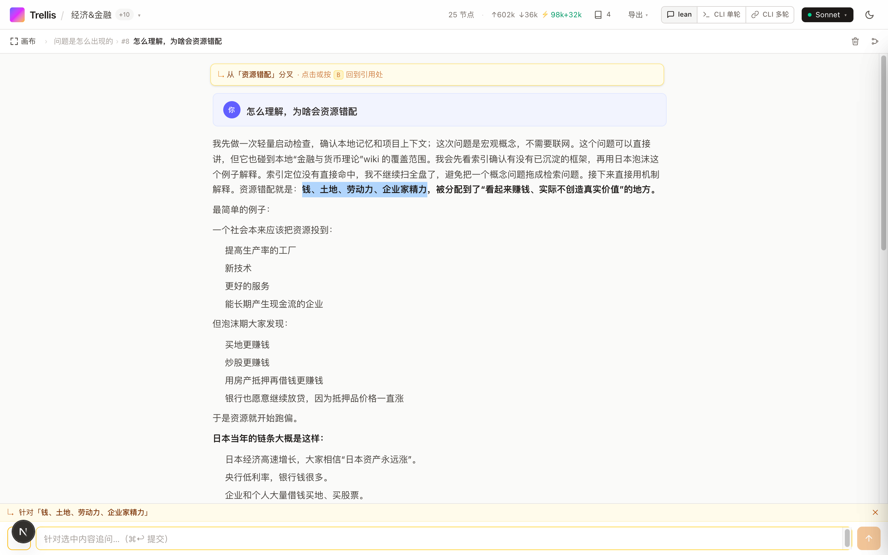
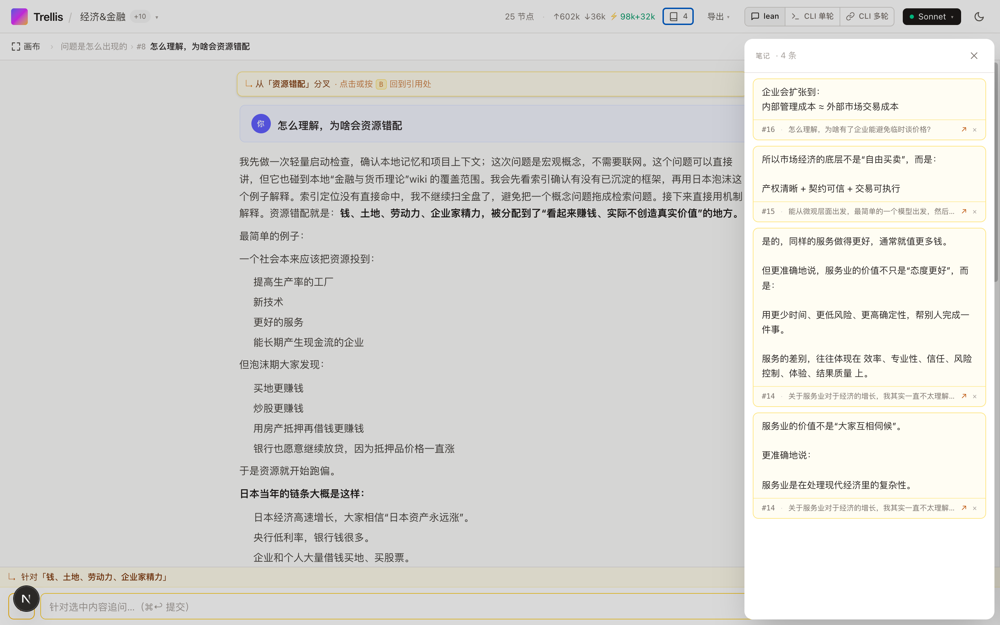
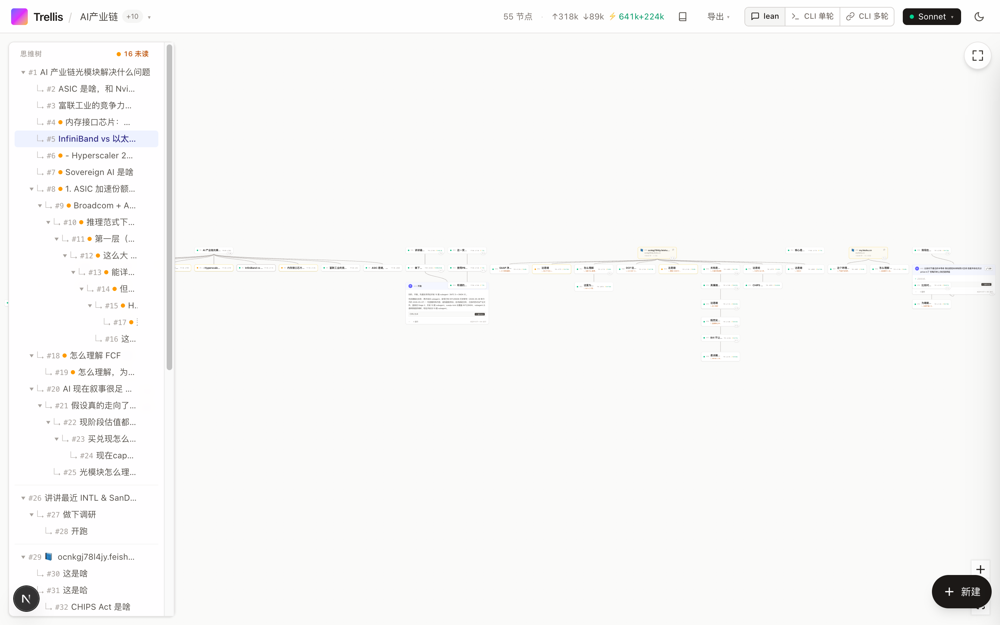
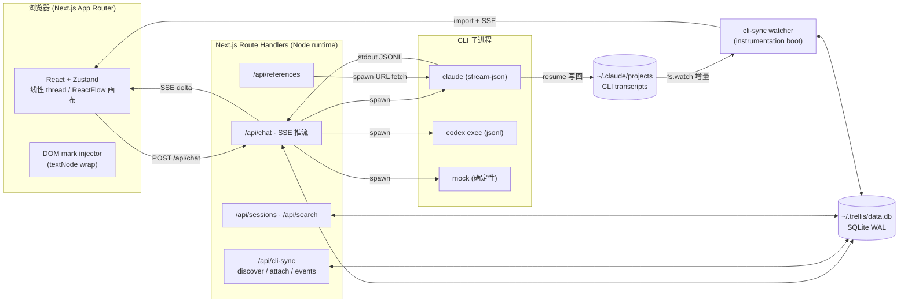

<p align="center">
  
</p>

<h1 align="center">Trellis</h1>

<p align="center">
  树状的 AI 对话 — 把"线性聊天"撕开成可分叉、可回跳、可聚焦阅读的思维树，
  <br/>同时和你本机的 Claude Code / Codex CLI 会话<b>双向打通</b>。
</p>

<p align="center">
  <a href="LICENSE"></a>
  <a href="https://bun.sh"></a>
  
  
  <a href="https://github.com/SmokingMouse/trellis/stargazers"></a>
</p>

<p align="center">
  <a href="#它解决什么">介绍</a> · <a href="#核心特性">核心特性</a> · <a href="#与-cli-双向打通">CLI 打通</a> · <a href="#quickstart">Quickstart</a> · <a href="#两种上下文模式详解">上下文模式</a> · <a href="#技术架构">技术架构</a> · <a href="#键盘快捷键">快捷键</a>
</p>

## 30 秒跑起来

1. 安装依赖：`make setup`
2. 启动服务：`make dev`
3. 访问地址：`http://localhost:3000`

前置依赖和进阶说明见下方 [Quickstart](#quickstart)。

---

<p align="center">
  
  <br/>
  <sub>Project 模式默认的<b>线性 thread 视图</b> —— 连续阅读 + 行内分叉「↳ N 个分支」+「在 CLI 继续」+ 右下角<b>树缩略图</b>导航</sub>
</p>

| 树状画布 — 思维树概览 | 聚焦阅读 — 锚点回跳 | 参考材料 — 飞书 / YouTube / 网页通吃 |
|:---:|:---:|:---:|
|  |  |  |

<details>
<summary>更多截图</summary>
<br/>

**行内分叉**：线性视图里真分叉折成「↳ N 个分支」，点开就地切到那条 lineage



**选区分叉**：在任意回复里选一段 → ⌘K 长出子节点



**笔记本**：选中 → 📌 进抽屉，点笔记跳回原节点 + 闪烁定位



**Wide tree**：55+ 节点的真实使用形态，深度学习 / 个股研究都能撑住



</details>

---

## 它解决什么

线性聊天有两个老问题：

1. **想顺手追问一句细节，整个上下文就跑偏了。** 你被迫在「问完再回主线」和「假装没看见」之间二选一。
2. **长会话尾段越聊越钝。** Claude/GPT 的实际有效上下文比标称小得多，一窗到底等于反复让模型在长 prompt 里做摘要。

Trellis 的处理方式：每个回答都是一个**节点**，选中文字 → ⌘K 即可在那一句旁边长出**分叉子节点**，原会话不动。每个分支独立流式生成、独立持久化、独立可回跳，画布上呈现整棵树。

而且它不是另起炉灶——Trellis 把请求转交给你本机的 `claude` / `codex` CLI 子进程，并且能把 CLI 已有的会话 **attach 进来双向同步**：CLI 里聊的、trellis 里聊的，落的是同一份 transcript，两边都看得到、都能续。

适合：长篇研究式问答（个股深度研究、技术学习、文档导读）、需要保留多条思路的探索、需要随时回到某个引用处对照的阅读，以及——把你在终端里跑的 Claude Code 会话搬进一个能浏览/搜索/分叉的工作台。

---

## 核心特性

### 双视图：线性 thread + 树状画布

- **线性 thread 主视图**（Project 默认）：像 ChatGPT 一样把当前 lineage 纵向铺开连续阅读；真分叉折成行内「↳ N 个分支」可展开切换；右下角 **SVG 树缩略图**导航全貌，点节点即跳
- **树状画布**：ReactFlow + Dagre 自动布局的全局思维树，一键在「线性 / 画布」之间切换
- **三层视图**：Layer 1 全局画布 / Layer 2 单节点聚焦 / Layer 3 全屏阅读
- **子树折叠**：卡片右下角 `▶ N` / `▼ N` 角标一键收起后代；折叠状态按 session 持久化
- **大纲侧边栏**：左侧树形 outline，**缩进按「分叉深度」而非轮数**——线性长聊保持平铺不跑出面板，只有真分叉才缩进
- **缩放分级渲染（LoD）**、**Fit View**（`F`）、切 active 平滑 pan

### 选区分叉与锚点

- **⌘K 分叉**：任意回复里选一段 → 浮 popover → 输入追问，新节点带 anchor 出生
- **锚点高亮 + 回跳**：父节点正文那段变黄 `<mark>`，点击跳到子节点；子节点全屏顶部常驻「从『…』分叉」横幅，`B` 一键回父节点引用处 + emerald 闪烁定位
- **编辑即重问**：全屏问题区铅笔 → 改问法 = 新建 sibling 分支，原问答无损保留，天然多版本对比
- **跨 markdown 结构**：代码块 / 表格 / 链接 / 加粗 / 列表都能正确包裹（React 渲染后直接 wrap textNode，不改 markdown 源）

### 与 CLI 双向打通

> 详见 [下方专章](#与-cli-双向打通)。这是 Trellis 区别于一般 AI 客户端的核心。

- **Attach 本机 CLI 会话**：浏览 `~/.claude/projects` 里已有的 Claude Code 会话清单，手选 attach 进 trellis（不按目录批量灌）
- **真双向实时同步**：CLI 侧聊新一轮 → watcher ≤1s 自动导入 trellis；trellis 侧续聊 → resume 写回同一份 jsonl + 身份对账。两边落同一 transcript
- **分支对齐**：CLI 的 rewind / `/branch` ↔ trellis 分叉双向对齐（一棵 trellis 树 = 一组 CLI session 按 message uuid 求并集）。trellis 从任意历史节点分叉 → 构造前缀 jsonl，在 CLI 侧也成为独立可 `--resume` 的会话
- **「在 CLI 继续」**：Project 会话每个回答下一键复制 `cd <workspace> && claude --resume <id>`，回终端无缝接着聊

### 参考材料

- **多种来源**：粘贴文本 / URL 抓取（飞书 / YouTube / GitHub / 普通网页通吃）
- **抓取策略不 hard-code**：URL 内容由 Claude/Codex CLI 自己挑工具（飞书走 feishu-cli、YouTube 走字幕、普通网页走 web-fetch）
- **抓取进度 ring** + **失败降级手动粘贴** + **⟳ 重新拉取**
- 参考节点同样能选区分叉发问，体验和 QA 节点一致

### 两种 LLM 上下文模式

session 创建时锁定 mode + workspace + **model**（per-session 持久化，切走再回来不会变），顶栏只读 badge 显示。详见 [下方专章](#两种上下文模式详解)。

| 模式 | 类比 | cwd | Tools / Skills / MCP | 跨节点记忆 | 适合 |
|---|---|---|---|---|---|
| **Chat** | GPT 网页客户端 | 无 | `WebSearch + WebFetch`；⚡ 增强模式 = scratch 目录 + 全工具 | 无 | 默认日常问答、补认知、查信息；临时跑个命令 / skill 开增强 |
| **Project** | Claude Projects / 长期项目 | session 绑定 | 全开 | 有（沿祖先链，分支间隔离） | 在仓库里干活、跨节点延续记忆，cache 命中通常 70%+ |

Provider 可切 **Claude**（Sonnet / Opus / Haiku）/ **Codex**（OpenAI）/ **Mock**（确定性假回复，看 UI 用），两档语义对齐。

### 工具调用与文件预览（Project / 增强 Chat）

- **工具调用可视化**：解析 stream-json 的 `tool_use` / `tool_result`，在节点折叠区展示每次 Bash / Read / Write / WebFetch 的入参与输出
- **交互式工具表单**：模型发起 `AskUserQuestion` / `ExitPlanMode` 时渲染成可填表单（单选/多选/批准计划），就地作答回灌
- **本地文件预览**：回答里生成或提到的文件 / HTML 直接在 trellis 内预览（HTML 走 opaque-origin sandbox iframe，图片/PDF/markdown 各自渲染）；行内像路径的代码也可点开。安全围栏 = session 实际碰过的目录范围，realpath 归一防逃逸

### 全文搜索 · 命令面板 · Skill

- **⌘P 跨 session 全文搜**：FTS5 trigram 分词（中英混排都能子串匹配），覆盖问题 / 回答 / 参考 / 笔记，按 mode facet 过滤
- **命令面板**：首屏输入框 `/` 前缀触发 —— `/new` `/clear`（🧹 开新话题/清空上下文）`/archive` `/switch` `/model` 等 session 元操作，纯 Trellis 命令本地执行不发 LLM
- **Skill 入口**：输入 `/<skill-name>` 复用 `~/.claude/skills/` 下 50+ skill（由 claude CLI 原生执行；纯 Chat 点选自动开启增强模式）
- **System Prompt 可配**（Chat）：5 个预设角色 + 自定义，per-session 锁定

### 会话工作台

- **Session tabs**：tmux 式常驻 tab 条 + `⌘1-9` 快切 + live 状态点（streaming / done / error）
- **归档**：软隐藏不删 jsonl/节点，可恢复
- **Header context 徽章**：当前上下文压力实时显示，≥50% 变可点 popover 提示开新话题
- **重开恢复浏览位置**：切回 session 回到上次离开的节点 + 视图层

### 图片输入（vision）

- **粘贴 / 拖拽 / 选文件**，两档模式通吃；Project 模式连续追问可跨节点引用同一张图
- **内容寻址存储**：blob 落 `~/.trellis/blobs/<sha256>.<ext>` 自动去重，不进 SQLite
- **重试自动带回原图**；单图 ≤ 10MB，单节点 ≤ 6 张；PNG / JPEG / WebP / GIF

### 笔记本

- 阅读时选中 + 📌 → 当前 session 笔记抽屉（桌面右侧 320px / 移动端底部 sheet）
- 点笔记卡 → 跳回源节点 + scroll-to + emerald 闪烁；per-session，删 session 自动清理

### 流式与中止

- **Enter 发送**（可一键切回 ⌘Enter）；流式中 `Esc` 或卡片 ⏹ 中止
- **保留半截响应**：中止后部分内容落库（`aborted` 灰色态），原 prompt 回填便于编辑重试
- **In-place retry**：失败/中止节点原地重试不新增节点
- **Durable streams**：spawn 与 HTTP 解耦，断线/切 tab 不杀生成，回来自动续上

### 视觉与未读追踪

- **节点编号 `#N`** + **未读小圆点**（停留 1s+ 自动标已读）+ **`J`/`K` 跳未读** + **Done Toast**
- **四桶 Token 计量**：input / output / cacheRead / cacheCreation；⚡ emerald 强调 cache 复用。context 占用按主 agent 当前窗口实际值算（非跨工具迭代累计，避免虚高数倍）

### 键盘快捷键

| 键 | 行为 | 作用域 |
|---|---|---|
| `⌘K` | 选区分叉 popover | 文本选中时 |
| `⌘D` | 选区入笔记本 | 文本选中时 |
| `⌘P` | 跨 session 全文搜索 | 全局 |
| `⌘↩` / `Enter` | 发送（默认 Enter，可切 ⌘Enter） | textarea |
| `Esc` | 关 popover / 中止流 / 关弹窗 | 全局 |
| `J` / `K` | 下/上一个未读节点（环绕） | 全局 |
| `Alt + 方向` | 节点导航：上=父 / 下=首子 / 左右=兄弟 | 全局 |
| `⌘1-9` | 切到第 N 个 session tab | 全局 |
| `F` | Fit canvas to viewport | 画布 |
| `B` | 回父节点锚点引用处 | 全屏阅读且有父节点时 |

### 导出与持久化

- **JSON 导出**（完整树 + token + 元数据）/ **Markdown 导出**（按深度生成层级标题，飞书友好）
- **本地落地**：SQLite `~/.trellis/data.db`（WAL，启动自迁移），全部 session / 节点 / 引用 / 笔记 / 节点位置持久化
- **session 管理**：picker 切换 / 改名 / 归档 / 删除（带确认）

### 主题与移动端

- 明暗主题一键切（localStorage 持久化 + 预水合防闪白）
- iOS Safari 选区双保险（polled + selectionchange），移动端专属 📌 按钮
- 响应式：outline / 笔记 / 缩略图在移动端转抽屉或底部 sheet；触屏支持画布缩放拖动

---

## 它不是什么

- 不是 SaaS。SQLite 落本地（`~/.trellis/data.db`），单人单机。
- 不是直接调 API。Trellis 把请求转交给本机 `claude` / `codex` CLI 子进程——订阅 / 余额 / 模型权限完全跟 CLI 走，Trellis 不存任何 API key。
- 不是为多人协作设计的。没有用户系统、没有同步；公网暴露请自带一层认证（仓库内置一个可选的 cookie 登录闸，见 `proxy.ts`）。

---

## Quickstart

### 前置依赖

- [Bun](https://bun.sh) v1.1+
- 至少装一个 LLM CLI（Trellis 不直接打 API，是 spawn 本机 CLI）：
  - [Claude Code CLI](https://docs.claude.com/en/docs/claude-code/quickstart)：`npm i -g @anthropic-ai/claude-code` → `claude` 可用并已登录
  - [Codex CLI](https://github.com/openai/codex)（可选）：`codex login` 完成登录
- Web 终端功能依赖宿主机安装 [ttyd](https://github.com/tsl0922/ttyd)。macOS 安装：`brew install ttyd`
- 完全不装 CLI 也能启动——provider picker 选 `Mock`，返回固定假回复，仅用于看 UI

Trellis 的 LLM/CLI 运行时层是普通 npm 依赖（[`@smokingmouse/agent`](https://www.npmjs.com/package/@smokingmouse/agent) + [`@smokingmouse/llm`](https://www.npmjs.com/package/@smokingmouse/llm)，源码在 [`sm-toolkit`](https://github.com/SmokingMouse/sm-toolkit)），`bun install` 一步装完，无需额外 clone/build 任何仓库。

### 跑起来

```bash
git clone https://github.com/SmokingMouse/trellis.git
cd trellis
make setup   # = bun install + 前置检查
make dev
```

只想看当前环境缺什么、不装任何东西：`make check`。

若未安装 `ttyd`，Trellis 仍可启动，但 Web 终端不可用；启动/部署日志与终端面板会提示 `ttyd` 缺失和 `brew install ttyd` 安装命令。Trellis 不会自动执行安装命令。

唯一的运行时注意点：必须用 `bun --bun run dev`（`make dev`/`make build`/`make start` 已经这么做了）——`bun run` 不会把 Next/Turbopack 内部起的 worker 进程纳入 bun 运行时，导致 `bun:sqlite`（`lib/server/sqlite.ts` 用）解析不到。

打开 http://localhost:3000，第一次输入问题即创建 session。想 attach 已有 CLI 会话：左侧 sidebar →「Attach CLI 会话」。

### 第三方模型（可选）

原生 claude / codex 走 CLI 登录态，零配置。想接 Anthropic 兼容的第三方端点（deepseek / kimi / ark …）：

```bash
mkdir -p ~/.config/sm
cp node_modules/@smokingmouse/llm/endpoints.example.yaml ~/.config/sm/endpoints.yaml
# 编辑它：填你自己的 provider / 模型清单，API key 只写环境变量名，key 本体放 env
```

搜索顺序 `$SM_ENDPOINTS_PATH` → `~/.config/sm/endpoints.yaml` → `~/.claude/global/endpoints.yaml`（legacy）。改完重启即出现在模型 picker。

### 本地开发 SDK（可选）

要改 `sm-toolkit` 本体时：clone 到 `~/sdk`，`make link-sdk` 把两个包软链过来（`bun install` 会冲掉软链，重跑即可）；`make unlink-sdk` 回到 registry 版本。

### 生产构建

单机随手跑一把：

```bash
make build && make start   # 固定 -p 3088；等价 bun --bun run build && bun --bun run start -- -p 3088
```

数据落 `~/.trellis/data.db`（SQLite WAL，自动迁移）。卸载只需删掉这个目录。

### 长驻部署与升级

如果 Trellis 是常驻服务（launchd / systemd），**不要**在它正在运行的那个目录里 `make build` 再重启：`next build` 会就地改掉运行中的 `.next`，build 失败就把服务打成半死，build 成功却忘了重启则是「内存里旧模块 + 磁盘上新文件」混跑（页面能开但交互全挂）。而且没有回滚路径。

改用 `make deploy`：

```bash
make deploy              # 部署当前 HEAD
make deploy REF=v1.2.0   # 部署指定 ref
make rollback            # 切回上一个 release
make deploy-status       # 看 current / previous 与上次部署状态
```

它做的事：把目标 commit 导出到 `~/.trellis/releases/<sha>/` 里装依赖并 build（**全程不碰正在跑的服务**）→ 用真数据库的一致性快照起一个临时实例，验证它真的能启动、能出页面、能读现网数据 → 备份数据库 → 原子换 `~/.trellis/current` 软链 + 重启 → 验活；验活不过**自动回滚**到上一个 release。

任何一步失败都不会动到正在跑的版本。实测切换窗口 ≈ 0.2s，且期间返回的是维护页而不是连接被拒——网关进程先占住端口、再拉起 Next，Next 起不来时它不会跟着自杀，而是退避重启并出 503 维护页（未登录只显示「正在更新」，版本号与日志要登录后才看得到）。`GET /__gate/health` 给出网关与 Next 的真实状态。

首次启用需要把常驻服务的工作目录指向软链，一次性：

```bash
make deploy            # 先建出第一个 release
make install-launchd   # 把 launchd 的 WorkingDirectory 改成 ~/.trellis/current（会先备份原 plist）
```

之后仓库目录就只是开发用的 checkout 了，在里面 build 不再影响线上。应急回滚不依赖仓库：`~/.trellis/bin/rollback.sh`。

> 有会话正在生成时 `make deploy` 会拒绝执行并列出是哪些（切换会中断它们）。确认要切就加 `FORCE=1`。

---

## 与 CLI 双向打通

Trellis 把每个会话当成真 Claude Code CLI 会话来对待——Project 模式本就是 spawn 真 `claude` 把 transcript 写进 `~/.claude/projects/<encoded-cwd>/<session-id>.jsonl`。在此之上做了三件事：

### Attach + 双向同步

- **发现 + attach**：浏览本机 CLI 会话清单（排除 trellis 自己 spawn 的，防回环），手选哪些 attach。attach 的会话 origin 标 `cli-import`，跑在 Project 模式
- **CLI → trellis**：watcher（`instrumentation.ts` 启动）监听 attached jsonl 所在目录，文件一变（CLI 侧聊了新轮 / rewind / `/branch`）→ debounce 后增量重导 → SSE 推前端无刷新 reload
- **trellis → CLI**：在 attached 会话续聊 = `claude --resume` 写回同一 jsonl；done 后**身份对账**（删临时流式节点，让 canonical jsonl-uuid 节点接管），两个方向收敛到同一份 transcript
- **物理约束**：同一会话别在 CLI 和 trellis 同时各聊一轮（抢 append）；串行无碍

### 分支对齐（一棵树 = 一组 CLI session）

CLI 的会话是线性的，trellis 的是树。统一模型：**一棵 trellis 树 = 一组 CLI session（root + 各 fork）按 message uuid 求并集**。

- CLI 里 `/branch`（或 `--fork-session`）出来的分支 jsonl 共享祖先 uuid → trellis 自动 union 成同一棵树的子树
- trellis 里从 tip 续 = 线性 append 同 jsonl；从**任意历史节点分叉** = trellis 构造一份「前缀 jsonl」（复制 root→X、复用 uuid、改 sessionId），`claude --resume` 当成在 X 分叉的合法会话——于是这条分支在 CLI 端也独立可 resume

### `/clear` 与 `/compact` 怎么对应

- **`/clear`**（CLI 抹掉上下文、开新 session id）→ 那是另一份不共享 uuid 的 jsonl，trellis **不会**自动并进当前树（它是「不相关的新对话」），而是作为一条独立可 attach 的会话出现。等价物 = trellis 的「🧹 新话题」（同树里加一个全新上下文的根）
- **`/compact`**（同 session 摘要压缩、不换 jsonl）→ 在原 jsonl 追加一个 `type:"system"` 边界节点，对话继续。trellis 读全量 jsonl，**边界前后所有原始轮都完整显示**（compact 只压缩「模型那侧的窗口」，不动存储）——解析器专门桥接这个 system 边界节点，保证父链不在 compact 处断裂

---

## 两种上下文模式（详解）

session 创建时锁定 mode + workspace，整棵树共用。两档差别在 prompt 怎么组装、CLI 走什么权限、是否绑定 cwd、跨节点要不要共享记忆，trade-off 是「成本 / 权限范围 / 上下文连续性」。

> 历史注：2026-07-16 砍掉了中间档 Workspace（一次性 CLI、每轮无状态）——实际用量为零，它的两个场景已被别人吃掉：临时跑命令/skill → Chat 增强模式；在仓库干活 → Project。存量 workspace 会话（如有）migrate 时自动归入 Project。

### Chat —— GPT 网页客户端替代

- Prompt：Trellis 自己组装"祖先链 → 当前问题"（深度可调 + anchor excerpt），用一个简短 system prompt
- 执行：claude 仅开 `WebSearch + WebFetch`，cwd `~`，不读 CLAUDE.md / 不加载 skills / MCP / Bash
- **每条分支真正独立**——claude 看到的只是 trellis 给的折叠历史，无外部副作用
- claude 家族默认走 **B-fork**（`--fork-session`，历史活在 fork 出的 CLI session 里，不往 prompt 折叠）
- **⚡ 增强模式**（可随时开关，点选 skill 自动开）：spawn 到 `~/.trellis/chat-scratch` scratch 目录 + 权限全开——能跑 skill / Bash / 文件工具，但不绑定你的仓库

### Project —— 长期协作 + per-lineage 真 CLI session

- Prompt：**只发当前问题**给 claude，让它 resume 持久 session 自己找历史
- 执行：**一条岔一个 claude session（lineage）**——顺着聊 = `--resume` 线性 append 同一份 jsonl；真分叉 = 在分叉点构造前缀 jsonl 成新 session（与 attached 会话的 P2 引擎同一套）；cwd 绑定 workspace_path
- **沿祖先链共享 claude 全部历史**（分支间互相隔离），线性续聊 cache hit 通常占 input token 70%+
- 「🧹 新话题」= 同树里另起一个 root（全新 fresh context，不 resume 旧记忆，对应 CLI `/clear`）
- 存量会话（per-lineage 上线前建的）保持旧的全树共享行为不迁移；新建 project session 自动 per-lineage

### Codex 那边

- `Chat` → codex sandbox `read-only`、tools 关，cwd `~`（Codex 暂无 WebSearch 等价，offline）；增强模式 = scratch 目录 + 整体绕过沙箱
- `Project` → `~/.codex/config.toml` + MCP 全开，共享 `~/.codex/sessions/<id>` 多轮 history，cwd = workspace_path

---

## 技术架构



- **前端**：Next.js 16 App Router，单页，所有"导航"都是 Zustand 状态。线性 thread + ReactFlow/Dagre 画布双视图；stream-bus 把 SSE delta 直喂 DOM，绕开 React 重渲染热路径
- **服务端**：Route Handlers（`runtime: nodejs`），spawn `claude -p … --output-format stream-json` / `codex exec --json`，按行解析 JSONL 转 SSE
- **CLI 同步**：`instrumentation.ts` 启动单例 watcher；解析器 `lib/server/cli-import.ts`（jsonl → Q/A 树，纯函数）+ `cli-import-db.ts`（union upsert）+ `cli-fork.ts`（前缀 jsonl 构造 / lineage 解析）
- **存储**：`~/.trellis/data.db`（better-sqlite3 WAL），schema 在 `lib/server/sqlite.ts` 启动自迁移
- **mark 注入**：选区/笔记/锚点高亮是 React 渲染**之后**对 textNode wrap `<mark>`（`lib/dom-mark-injector.ts`），不改 markdown 源

更详细的架构决策见 `progress/` 下各 spec（CLI 同步、分支对齐 P1/P2、线性视图等）。

---

## 项目结构

```
app/                 Next.js App Router 页面 + API routes（含 api/cli-sync）
components/           React UI（LinearThreadView / Canvas / NodeFullView / Outline / …）
hooks/               useUnreadNavigation / useCliSyncEvents / useReconnectStreams / …
lib/
  collapsed.ts        折叠/祖先链纯函数
  layout.ts           Dagre 布局 + LoD 阈值
  llm/                provider 抽象（claude / codex / mock）
  server/
    cli-import*.ts     CLI jsonl 解析 + DB union 导入
    cli-fork.ts        前缀 jsonl 构造 / lineage 解析 / 在 CLI 继续
    cli-sync-*.ts      watcher + SSE 事件
    repo.ts / sqlite.ts  DB 访问 + schema 迁移
    run-bus.ts         spawn 所有权 + durable streams
stores/               Zustand session store（视图 / 折叠 / 流式控制）
progress/             开发 dashboard + session log + 各 feature spec
instrumentation.ts    Next 启动钩子：拉起 CLI 同步 watcher
```

---

## 现状

**Alpha**，自用为主，已在生产环境跑了一段时间。还存在的粗糙边角：

- 移动端（≤ 640px）只做到能用，iOS Safari 上选区分叉偶有抖动
- 没有用户/权限/同步——多人用法请加 reverse proxy 或用内置 cookie 闸
- 分支对齐 P2 的「从历史节点分叉」已端到端验证，但树内分叉的 fork 文件会在 CLI 项目目录里累积（可接受，Claude 自己 `/branch` 也这样）

欢迎提 Issue / PR，但请理解定位是个人工具，不会为了泛用化把模型 / 路由抽象到框架级别。

---

## License

MIT（见 [LICENSE](LICENSE)）。底层依赖的 Claude Code / Codex CLI 各有自己的服务条款，自行确认。

---

## Star History

<a href="https://www.star-history.com/#SmokingMouse/trellis&Date">
  
</a>
