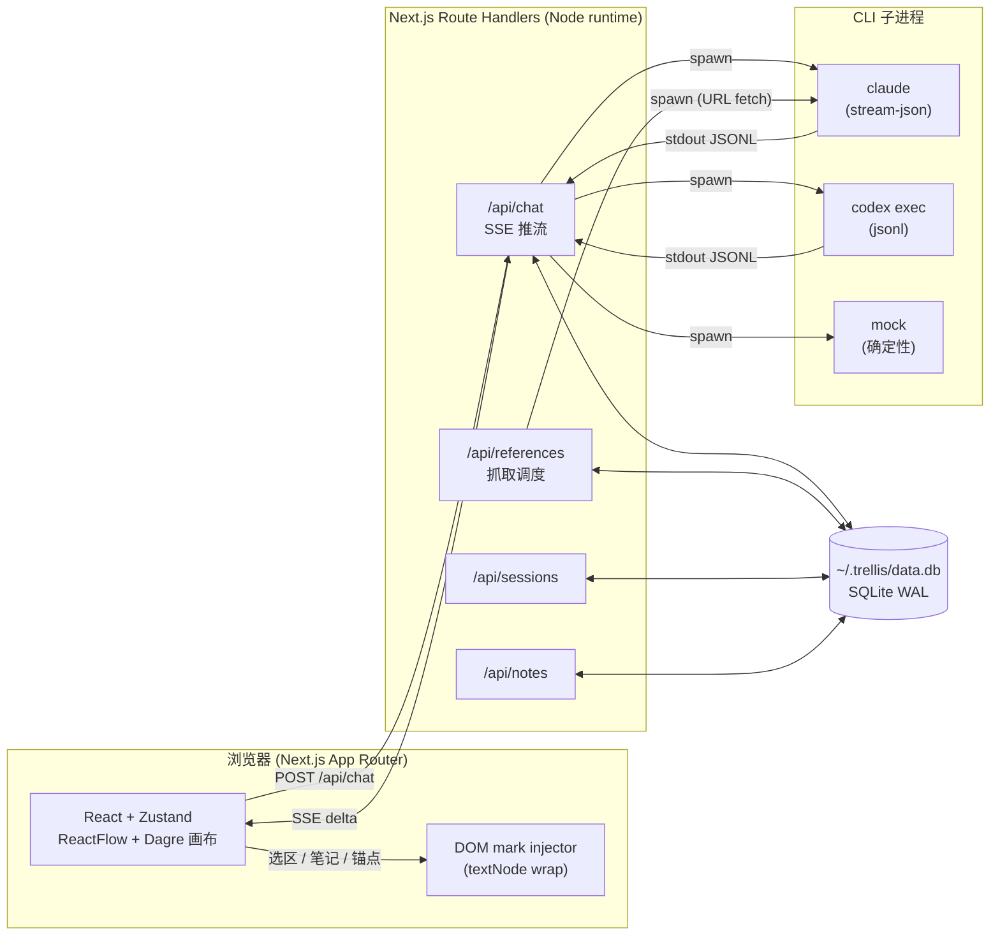

<p align="center">
  
</p>

<h1 align="center">Trellis</h1>

<p align="center">
  树状的 AI 对话 — 把"线性聊天"撕开成可分叉、可回跳、可以聚焦阅读的思维树。
</p>

<p align="center">
  <a href="LICENSE"></a>
  <a href="https://nodejs.org"></a>
  
  
  <a href="https://github.com/SmokingMouse/trellis/stargazers"></a>
</p>

<p align="center">
  <a href="#它解决什么">介绍</a> · <a href="#核心特性">核心特性</a> · <a href="#quickstart">Quickstart</a> · <a href="#三种上下文模式详解">上下文模式</a> · <a href="#技术架构">技术架构</a> · <a href="#键盘快捷键">快捷键</a>
</p>

---

| 树状画布 — 思维树概览 | 聚焦阅读 — 锚点回跳 | 参考材料 — 飞书 / YouTube / 网页通吃 |
|:---:|:---:|:---:|
|  |  |  |

<details>
<summary>更多截图</summary>
<br/>

**选区分叉**：在任意回复里选一段 → ⌘K 长出子节点


**笔记本**：选中 → 📌 进抽屉，点笔记跳回原节点 + 闪烁定位


**Wide tree**：55+ 节点的真实使用形态，深度学习 / 个股研究都能撑住


</details>

---

## 它解决什么

线性聊天有两个老问题：

1. **想顺手追问一句细节，整个上下文就跑偏了。** 你被迫在「问完再回主线」和「假装没看见」之间二选一。
2. **长会话尾段越聊越钝。** Claude/GPT 的实际有效上下文比标称小得多，一窗到底等于反复让模型在长 prompt 里做摘要。

Trellis 的处理方式：每个回答都是一个**节点**，选中文字 → ⌘K 即可在那一句旁边长出**分叉子节点**，原会话不动。每个分支独立流式生成、独立持久化、独立可回跳，画布上呈现整棵树。

适合：长篇研究式问答（个股深度研究、技术学习、文档导读）、需要保留多条思路的探索、需要随时回到某个引用处对照的阅读。

---

## 核心特性

### 树状画布

- **三层视图**：Layer 1 全局画布（ReactFlow + Dagre 自动布局）/ Layer 2 单节点聚焦 / Layer 3 全屏阅读
- **子树折叠**：每张卡片右下角 `▶ N` / `▼ N` 角标，一键收起后代节点；折叠状态按 session 持久化
- **缩放分级渲染（LoD）**：低缩放显示紧凑卡片，高缩放展开完整内容；阈值穿越才重排，不每帧抖动
- **Fit View / 自动居中**：`F` 一键 fit；切换 active 节点时画布平滑 pan 到目标，不动用户当前缩放级别
- **大纲侧边栏**：左侧树形 outline，缩进表示父子关系，节点编号 `#N`，未读小圆点

### 选区分叉与锚点

- **⌘K 分叉**：任意回复里选一段文字 → 浮出 popover → 输入追问，新节点带 anchor 出生
- **锚点高亮**：父节点正文里那段会变黄色 `<mark>`，点击直接跳到子节点
- **Sticky 回跳横幅**：子节点全屏阅读时，顶部一直露着「从『...』分叉」横幅，按 `B` 一键回到父节点引用处，emerald 闪烁定位
- **跨 markdown 结构**：代码块、表格、链接、加粗、列表都能正确包裹，不破坏原文渲染（实现走的不是改 markdown 源，而是 React 渲染完后对 textNode 直接 wrap `<mark>`）

### 参考材料

- **多种来源**：粘贴文本 / URL 抓取（飞书 / YouTube / GitHub / 普通网页通吃）
- **抓取策略不 hard-code**：URL 内容由 Claude/Codex CLI 自己挑工具（飞书走 feishu-cli、YouTube 走字幕提取、普通网页走 web-fetch）
- **抓取进度 ring**：fetch 中卡片边缘有进度环；失败可降级为手动粘贴
- **重新拉取**：⟳ 按钮一键重抓最新内容
- **同样的子节点能力**：参考节点上可以继续选区分叉发问，体验和 QA 节点一致

### 三种 LLM 上下文模式

每个 session 独立保存，顶栏 `lean / CLI 单轮 / CLI 多轮` 切换。详见 [下方专章](#三种上下文模式详解)。

| 模式 | 上下文来源 | Tools / Skills / MCP | 跨节点记忆 | 适合 |
|---|---|---|---|---|
| **lean** | Trellis 折叠的祖先链 | 全关 | 无 | 默认日常问答、便宜、快 |
| **CLI 单轮** | Trellis 折叠的祖先链 | 全开（bypassPermissions） | 无 | 单次问答需要联网/读文件/调 MCP |
| **CLI 多轮** | 整棵树共享真 CLI session | 全开 | 有 | 跨节点延续记忆，cache 命中通常 70%+ |

Provider 可切 **Claude**（Sonnet / Opus / Haiku）/ **Codex**（OpenAI）/ **Mock**（确定性假回复，看 UI 用），三档语义对齐。

### 笔记本

- **选区入笔记**：阅读时选中 + 📌 → 当前 session 的笔记抽屉
- **响应式抽屉**：桌面右侧 320px / 移动端底部 sheet
- **回跳定位**：点笔记卡 → 跳回源节点 + scroll-to + emerald 闪烁
- **per-session**：跟着 session 走，删 session 自动清理

### 流式与中止

- **Cmd+Enter 发送**：`Enter` 是换行（防误触）
- **流式中按 Esc 中止**：全局监听，活跃节点优先；卡片上也有 ⏹ 按钮（和发送按钮同位，无 layout 抖动）
- **保留半截响应**：中止后部分内容落库，状态置为 `aborted`（灰色样式区分于 `error`），原 prompt 文本回填到输入框便于编辑重试
- **In-place retry**：失败/中止节点原地重试，不新增节点

### 视觉与未读追踪

- **节点编号**：`#N` 按 createdAt 顺序在 session 内编号
- **未读小圆点**：`status=done` 但 `readAt=null` 的节点；停留 1s+ 自动标已读
- **`J` / `K` 跳未读**：按时间序在未读节点之间跳跃，配合 outline 「只看未读」过滤
- **Done Toast**：流式完成但当前不在视野内的节点，右下角累积通知，点击跳过去
- **四桶 Token 计量**：每节点拆 input / output / cacheRead / cacheCreation；header 总览，节点卡 footer 紧凑显示，⚡ emerald 强调 cache 复用（cli-multi 模式特别有用）

### 键盘快捷键

| 键 | 行为 | 作用域 |
|---|---|---|
| `⌘K` | 选区分叉 popover | 文本选中时 |
| `⌘D` | 选区入笔记本 | 文本选中时 |
| `⌘↩` | 发送 / 提交分叉 | 任意 textarea |
| `Enter` | 换行 | textarea |
| `Esc` | 关 popover / 中止流 / 关弹窗 | 全局 |
| `J` | 下一个未读节点 | 全局（环绕） |
| `K` | 上一个未读节点 | 全局（环绕） |
| `F` | Fit canvas to viewport | 画布 |
| `B` | 回父节点的锚点引用处 | 全屏阅读且有父节点时 |

### 导出与持久化

- **JSON 导出**：`.trellis.json` 完整树结构 + token 计数 + 全部元数据
- **Markdown 导出**：按深度生成层级标题（h1–h6），飞书友好
- **本地落地**：SQLite 在 `~/.trellis/data.db`（WAL 模式，启动自迁移），全部 session / 节点 / 引用 / 笔记 / 节点位置都持久化
- **session 管理**：picker 切换、改名、删除（带确认）；折叠状态走 sessionStorage（per-session，关 tab 重置）

### 主题与移动端

- **明暗主题切换**：header 一键切，localStorage 持久化，启动脚本预水合避免闪白
- **iOS Safari 选区**：兼容 polled 选区检测 + selectionchange 双保险，移动端有专属 📌 按钮
- **响应式**：outline 在 ≤ 640px 隐藏；笔记 / 树概览抽屉在移动端转底部 sheet；触屏支持画布缩放 / 拖动

---

## 它不是什么

- 不是 SaaS。SQLite 落本地（`~/.trellis/data.db`），单人单机。
- 不是直接调 API。Trellis 把请求转交给本机的 `claude` 和 `codex` CLI 子进程——你的订阅 / 余额 / 模型权限完全跟着 CLI 走，Trellis 不存任何 API key。
- 不是为了多人协作设计的。没有用户系统，没有同步机制。

---

## Quickstart

### 前置依赖

- Node.js 20+ 和 npm
- 至少装一个 LLM CLI（Trellis 不直接打 API，是 spawn 本机 CLI）：
  - [Claude Code CLI](https://docs.claude.com/en/docs/claude-code/quickstart)：`npm i -g @anthropic-ai/claude-code` → `claude` 可用并已登录
  - [Codex CLI](https://github.com/openai/codex)（可选）：`codex login` 完成 ChatGPT/API 登录
- 完全不装 CLI 也能启动——provider picker 里选 `Mock`，只是返回固定假回复，仅用于看 UI

### 跑起来

```bash
git clone https://github.com/SmokingMouse/trellis.git
cd trellis
npm install
npm run dev
```

打开 http://localhost:3000，第一次输入问题即创建 session。

### 生产构建

```bash
npm run build
npm run start -- -p 3088
```

数据落 `~/.trellis/data.db`（SQLite，WAL 模式，自动迁移）。卸载只需删掉这个目录。

---

## 三种上下文模式（详解）

顶栏 `lean / CLI 单轮 / CLI 多轮` 切换，**每个 session 独立保存**。三档差别在 prompt 怎么组装、CLI 走什么权限、跨节点要不要共享记忆，trade-off 是「成本/权限范围/上下文连续性」。

### lean —— 最便宜的纯文本模式

- Prompt：Trellis 自己组装"祖先链 → 当前问题"，用一个简短 system prompt
- 执行：`claude --tools "" --system-prompt ... --no-session-persistence`
- 不读 `~/.claude/CLAUDE.md`，不加载 skills / MCP / 任何 tool
- **每条分支真正独立**——claude 看到的是 trellis 给它的折叠历史，没有任何外部副作用
- 用法：默认就用这个。Token 主要花在你的祖先链上下文（`深度=2 + anchor excerpt`），response 里的 markdown 也是纯文字
- 注意：claude 不能联网、不能跑 bash、不能读文件——这条问答如果需要外部信息，得切到下面两档

### CLI 单轮 —— 全 toolset，但每节点独立

- Prompt：和 lean 一样的"祖先链 → 当前问题"
- 执行：`claude --permission-mode bypassPermissions`（cwd 是用户家目录）
- **加载 ~/.claude/CLAUDE.md + 全部 skills + MCP servers + Bash/Write/Edit/WebFetch/WebSearch 全开**
- 跨节点不共享 claude 内部记忆——只有 trellis 给的折叠上下文是连续的，CLI 自身每次 `--no-session-persistence`
- 用法：当前节点要 claude 联网、跑命令、查看本地文件，又不希望把这些 tool call 历史污染下一个分支时
- 注意：tool call 计数也算进 token；一次 web fetch 可能花掉好几百 input token

### CLI 多轮 —— 整棵树共享一条 claude session

- Prompt：**只发当前问题**给 claude（不带祖先链），让 claude 自己 resume 一个持久 session 找历史
- 执行：第一次 `claude ...` 自动生成 session id，trellis 存进 `sessions.claude_session_id`；后续 `claude --resume <id>` 续上
- Session JSONL 落在 `~/.claude/projects/<...>/`，删除 trellis session 时一起删
- **跨节点共享 claude 的全部历史**——分支不再隔离，claude 看到的是树扁平化后的线性时间序
- 用法：连续追问中希望 claude 自己积累记忆（之前查过的 doc、之前 cd 进的目录、之前算过的中间结果），cache hit 比例会很高（cli-multi 缓存命中通常占 input token 70%+）
- ⚠️ 副作用：分叉的"独立思路"语义被打破，平行节点其实彼此知道对方说了啥；如果你需要"两条互不影响的探索"切回 lean / CLI 单轮

### Codex 那边

provider 切到 Codex 后，三档对应：

- `lean` → codex sandbox `read-only`、tools 关
- `CLI 单轮` → 加载 `~/.codex/config.toml` + MCP，YOLO sandbox（Bash/Write/Edit 自动放行）
- `CLI 多轮` → 共享 `~/.codex/sessions/<id>` 的多轮 history

---

## 技术架构



- **前端**：Next.js 16 App Router，单页，所有"导航"都是 Zustand 状态。ReactFlow + Dagre 做画布，stream-bus 把 SSE delta 直接喂给 DOM `textContent`，绕开 React 重渲染热路径。
- **服务端**：Next.js Route Handlers (`runtime: nodejs`)，spawn `claude -p ... --output-format stream-json` 或 `codex exec --json`，按行解析 JSONL，转成 SSE 推给浏览器。
- **存储**：`~/.trellis/data.db`（better-sqlite3，WAL）。Schema 在 `lib/server/sqlite.ts`，启动时自迁移。
- **mark 注入**：选区分叉 / 笔记 / 跳回 anchor 的高亮，是 React 渲染完成**之后**直接对 textNode 做 `<mark>` wrap（`lib/dom-mark-injector.ts`），不是改 markdown 源——绕开 markdown 语法字符（代码块、表格、链接、加粗、列表前缀）和原文不一致的问题。

更详细的架构决策见 `progress/` 目录下的各 spec。

---

## 项目结构

```
app/                 Next.js App Router 页面 + API routes
components/          React UI（Canvas / NodeFullView / Outline / etc.）
hooks/               useUnreadNavigation / useEscapeAbort / etc.
lib/
  collapsed.ts       折叠子树相关纯函数
  dom-mark-injector  DOM textNode 包 <mark> 实现
  format-tokens.ts   token 数字格式化
  layout.ts          Dagre 布局 + LoD 阈值
  llm/               provider 抽象（claude / codex / mock）
  server/            DB / SSE / fetch-via-* / repo
stores/              Zustand session store（含折叠 / 流式控制器）
progress/            开发阶段 README + 每次 session log + 各 feature 的 spec
public/              icon / manifest
docs/screenshots/    README 用截图
```

---

## 现状

**Alpha**，自用为主。已经在生产环境跑了一段时间，但还存在一些粗糙边角：

- Dagre 布局在树宽 30+ 节点时偶尔需要手动 `F` 重 fitView
- mobile（≤ 640px）的体验只做到能用，键盘快捷键和选区分叉在 iOS Safari 上偶有抖动
- 没有用户/权限/同步——多人用法请自行加一层 reverse proxy auth
- "新提问"在 cli-multi 模式下会继承上一节点的 LLM 记忆（不是真 fresh context）

欢迎提 Issue / PR，但请理解定位是个人工具，不会为了泛用化把模型 / 路由抽象到框架级别。

---

## License

MIT（见 [LICENSE](LICENSE)）。底层依赖的 Claude Code / Codex CLI 各有自己的服务条款，自行确认。

---

## Star History

<a href="https://www.star-history.com/#SmokingMouse/trellis&Date">
  
</a>
